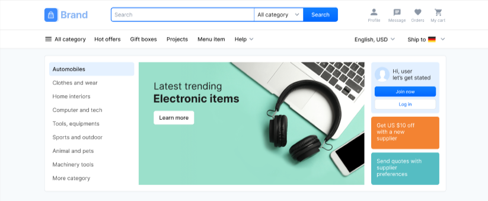

# ShopFluence

## 🛍️ Modern E-commerce Platform

[](https://shopfluencestore.netlify.app/)
[](https://opensource.org/licenses/MIT)
[](https://nextjs.org/)
[](https://www.typescriptlang.org/)
[](https://tailwindcss.com/)



## ✨ Features

- 🚀 **Blazing Fast Performance** - Built with Next.js 13+ for optimal speed and SEO
- 📱 **Fully Responsive** - Seamless experience across all devices
- 🎨 **Modern UI/UX** - Clean, intuitive interface with smooth animations
- 🛒 **Shopping Cart** - Intuitive cart management system
- 🔍 **Product Search** - Fast and accurate product search functionality
- 📧 **Newsletter** - Stay updated with latest products and offers
- 🔒 **Secure Checkout** - Safe and secure payment processing

## 🚀 Live Demo

Experience ShopFluence live: [https://shopfluencestore.netlify.app/](https://shopfluencestore.netlify.app/)

## 🛠️ Tech Stack

- **Frontend Framework**: Next.js 13+ (App Router)
- **Styling**: Tailwind CSS with CSS Modules
- **UI Components**: Radix UI Primitives
- **Icons**: Lucide Icons
- **Language**: TypeScript
- **Build Tool**: Turbopack

## 🚀 Quick Start

1. **Clone the repository**

   ```bash
   git clone https://github.com/CodeGeniusDev/ShopFluence.git
   cd ShopFluence
   ```

2. **Install dependencies**

   ```bash
   npm install
   # or
   yarn install
   ```

3. **Start development server**

   ```bash
   npm run dev
   # or
   yarn dev
   ```

   Open [http://localhost:3000](http://localhost:3000) to view it in your browser.

## 📂 Project Structure

```text
shopfluence/
├── app/           # App router pages and layouts
├── components/     # Reusable UI components
├── constants/      # Application constants
├── lib/            # Utility functions and helpers
├── public/         # Static files
└── styles/         # Global styles and CSS modules
```

## 🤝 Contributing

Contributions are what make the open source community such an amazing place to learn, inspire, and create. Any contributions you make are **greatly appreciated**.

1. Fork the Project
2. Create your Feature Branch (`git checkout -b feature/AmazingFeature`)
3. Commit your Changes (`git commit -m 'Add some AmazingFeature'`)
4. Push to the Branch (`git push origin feature/AmazingFeature`)
5. Open a Pull Request

## 📄 License

Distributed under the MIT License. See `LICENSE` for more information.

---

Made with ❤️ by [CodeGenius.Dev](https://portfolio.triplealpha.blog) | [View on GitHub](https://github.com/CodeGeniusDev/ShopFluence)
